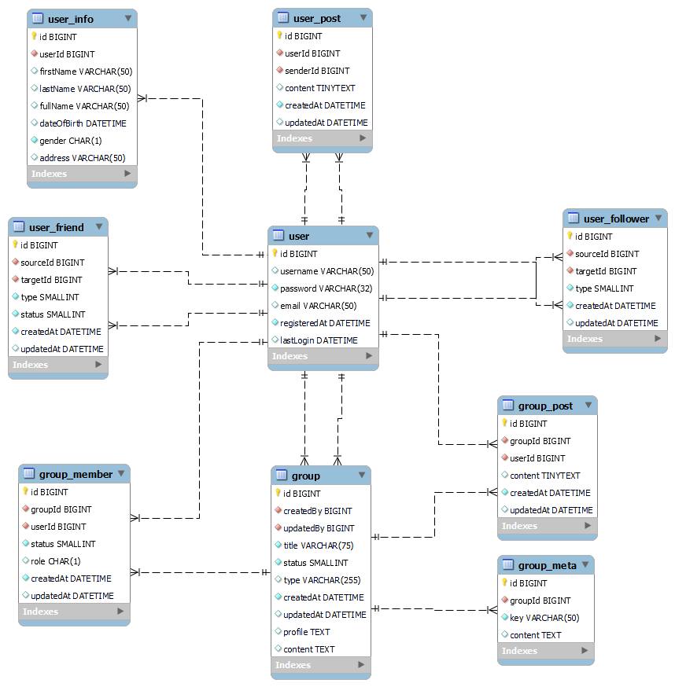
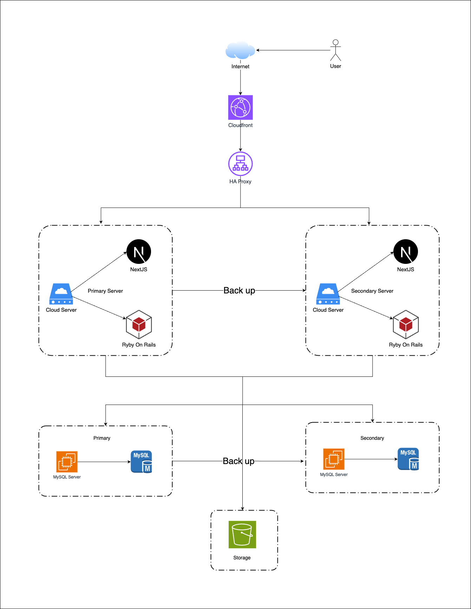
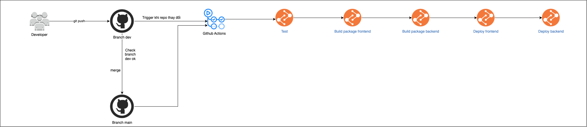

## Team members

## Tech stack

- Frontend: Next.js
- Backend: Ruby on Rails
- Database: MySQL
- Deployment: Cloud Server
- CI/CD: Github Actions
- Version Control: Git

## Runtime Environment

- Node.js 18.16.1
- NPM 9.5.1
- Ruby 3.0.2
- Rails 7.0.7.2

## How to setup

### web

```bash
$ cd web
$ npm install
```

### api

```bash
$ cd api
$ bundle install
```

## How to run

### web

```bash
$ cd web

# development
$ npm run dev

# production
$ npm run build
$ npm run start

```

### api

```bash
$ cd api

# development
$ rails server

# production
$ rails server
```

## Set up cloud server Next.js

### Install pm2

```bash
$ npm install pm2 -g
```

### Set up pm2 process

```bash
cd /path/to/your/project (ex: cd /home/runner/actions-runner/_work/social-media-web/social-media-web/web)
pm2 start ecosystem.config.js
```

### Check pm2 status

```bash
pm2 status
```

## Set up cloud server ruby on rails

### Install systemd

```bash
$ sudo apt install -y systemd
```

### Set up Puma

```bash
$ sudo nano /etc/systemd/system/puma.service
```

Copy and paste the following configuration:

```bash
[Unit]
Description=Puma HTTP Server
After=network.target

[Service]
Type=simple
User=runner
WorkingDirectory=/home/runner/actions-runner/_work/social-media-web/social-media-web/api
ExecStart=/home/runner/.rbenv/shims/rails server -b 0.0.0.0 -p 4000
Restart=always
RestartSec=5

[Install]
WantedBy=multi-user.target[Unit]
```

### Start Puma

```bash
$ sudo systemctl start puma.service
```

### Check Puma status

```bash
$ sudo systemctl status puma.service
```

## Todo list

### Auth module

- [x] [Login](#login)

### User module

- [x] [Create user](#create-user)
- [x] [Get user detail](#get-user-detail)
- [ ] [Update user](#update-user)
- [ ] [Delete user](#delete-user)

### Post module

- [ ] [Create post](#create-post)
- [ ] [Get post detail](#get-post-detail)
- [ ] [Update post](#update-post)
- [ ] [Delete post](#delete-post)

## API Reference

### Auth module

#### Login

```http
POST /api/auth/login
```

| Parameter  | Type     | Description  |
| :--------- | :------- | :----------- |
| `email`    | `string` | **Required** |
| `password` | `string` | **Required** |

```javascript
{
    "success": true,
    "message": "Login successfully",
    "data": {
        "user": {
            ...
        },
        "token": "..."
    },
}
```

#### Register

```http
POST /api/auth/register
```

| Parameter  | Type     | Description  |
| :--------- | :------- | :----------- |
| `email`    | `string` | **Required** |
| `password` | `string` | **Required** |
| `first_name` | `string` | **Required** |
| `last_name` | `string` | **Required** |

```javascript
{
    "success": true,
    "message": "Login successfully",
    "data": {
        "user": {
            ...
        },
        "token": "..."
    },
}
```

### User module
#### Get user detail

```http
Authorization: Bearer YOUR_TOKEN
GET /api/users/:id
```
Không truyền ID thì lấy thông tin qua token
Còn truyền ID thì không cần token

| Header          | Type     | Description                                   |
| :-------------- | :------- | :-------------------------------------------- |
| `Authorization` | `string` | **Required.** Bearer Token for authentication |

| Path Variables | Type     | Description  |
| :------------- | :------- | :----------- |
| `id`           | `string` | **Required** |

```javascript
{
    "success": true,
    "message": "User detail",
    "data": {
        "user": {
            ...
        },
    },
}
```

#### Update user

```http
Authorization: Bearer YOUR_TOKEN
PUT /api/users
```
Dùng form-data để truyền avatar, background

| Header          | Type     | Description                                   |
| :-------------- | :------- | :-------------------------------------------- |
| `Authorization` | `string` | **Required.** Bearer Token for authentication |

| Parameter  | Type     | Description  |
| :--------- | :------- | :----------- |
| `password` | `string` | **Optional** |
| `first_name`         | `string`   | Họ                                                |
| `last_name`          | `string`   | Tên                                               |
| `full_name`          | `string`   | Họ và tên                                         |
| `phone_number`        | `string`   | SĐT                                               |
| `date_of_birth`       | `date`     | Ngày sinh                                         |
| `gender`              | `integer`  | 0 - Nam, 1 - Nữ, 2 - Không rõ                     |
| `avatar`          | `file_ảnh`   | Ảnh đại diện                                      |
| `address`             | `string`   | Địa chỉ                                           |
| `bio`                 | `string`   | Mô tả ngắn gọn                                    |
| `relationship_status` | `integer`  | Tình trạng: 1 - Độc thân, 2 - Kết hôn, 3 - Hẹn hò |

```javascript
{
    "success": true,
    "message": "User updated successfully",
    "data": {
        "user": {
            ...
        },
    },
}
```

#### Delete avatar

```http
Authorization: Bearer YOUR_TOKEN
DELETE /api/users/avatar
```

| Header          | Type     | Description                                   |
| :-------------- | :------- | :-------------------------------------------- |
| `Authorization` | `string` | **Required.** Bearer Token for authentication |

```javascript
{
    "success": true,
    "message": "User info",
    "data": {
        "message": "Thành công"
    },
}
```

### Post module

#### Create post

```http
Authorization: Bearer YOUR_TOKEN
POST /api/posts
```

| Header          | Type     | Description                                   |
| :-------------- | :------- | :-------------------------------------------- |
| `Authorization` | `string` | **Required.** Bearer Token for authentication |

| Parameter  | Type     | Description  |
| :--------- | :------- | :----------- |
| `content`  | `string` | **Required** |
| `image`    | `string` | **Optional** |

```javascript
{
    "success": true,
    "message": "Post created successfully",
    "data": {
        "post": {
            ...
        },
    },
}
```

#### Get post detail

```http
Authorization: Bearer YOUR_TOKEN
POST /api/posts/:id
```

| Path Variables | Type     | Description  |
| :------------- | :------- | :----------- |
| `id`           | `string` | **Required** |

| Header          | Type     | Description                                   |
| :-------------- | :------- | :-------------------------------------------- |
| `Authorization` | `string` | **Required.** Bearer Token for authentication |

#### Update post

```http
Authorization: Bearer YOUR_TOKEN
PATCH /api/posts/:id
```

| Path Variables | Type     | Description  |
| :------------- | :------- | :----------- |
| `id`           | `string` | **Required** |

| Header          | Type     | Description                                   |
| :-------------- | :------- | :-------------------------------------------- |
| `Authorization` | `string` | **Required.** Bearer Token for authentication |

#### Delete post

```http
Authorization: Bearer YOUR_TOKEN
DELETE /api/posts/:id
```

| Path Variables | Type     | Description  |
| :------------- | :------- | :----------- |
| `id`           | `string` | **Required** |

| Header          | Type     | Description                                   |
| :-------------- | :------- | :-------------------------------------------- |
| `Authorization` | `string` | **Required.** Bearer Token for authentication |

## Architecture Design

### Database Design



### Infrastructure Design (Single-Server Architecture: Web + API)



### CI/CD Design


