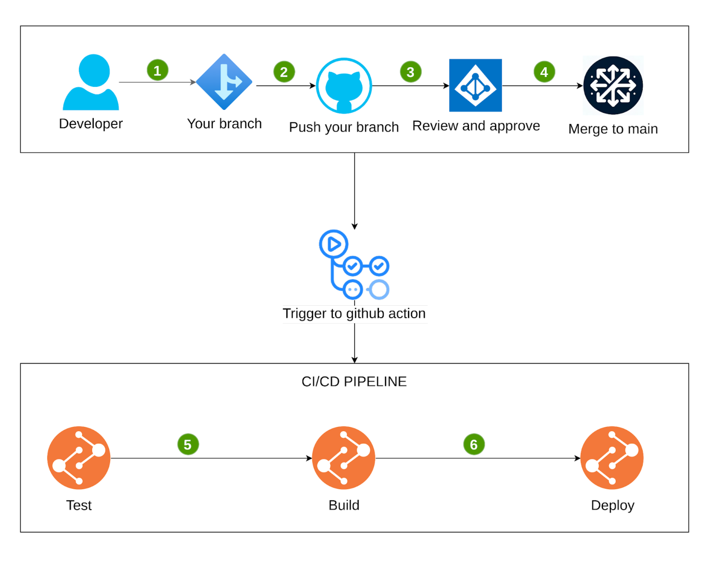

## Team members

## Tech stack

- Frontend: Next.js
- Backend: Ruby on Rails
- Database: MySQL
- Deployment: Cloud Server
- CI/CD: Github Actions
- Version Control: Git

## Runtime Environment

- Node.js 18.16.1
- NPM 9.5.1
- Ruby 3.0.2
- Rails 7.0.7.2

## How to setup

### web

```bash
$ cd web
$ npm install
```

### api

```bash
$ cd api
$ bundle install
```

## How to run

### web

```bash
$ cd web

# development
$ npm run dev

# production
$ npm run build
$ npm run start

```

### api

```bash
$ cd api

# development
$ bundle exec rails s

# production
$ bundle exec rails s
```

## Todo list

### Auth module

- [x] [Login](#login)

### User module

- [x] [Create user](#create)
- [x] [Get user detail](#get-user-detail)

## API Reference

### Auth module

#### Login

```http
POST /api/auth/login
```

| Parameter  | Type     | Description  |
| :--------- | :------- | :----------- |
| `email`    | `string` | **Required** |
| `password` | `string` | **Required** |

```javascript
{
    "success": true,
    "message": "Login successfully",
    "data": {
        "user": {
            ...
        },
        "token": "..."
    },
}
```

### User module

#### Create user

```http
POST /api/users
```

| Parameter  | Type     | Description  |
| :--------- | :------- | :----------- |
| `email`    | `string` | **Required** |
| `password` | `string` | **Required** |
| `name`     | `string` | **Required** |

```javascript
{
    "success": true,
    "message": "User created successfully",
    "data": {
        "user": {
            ...
        },
    },
}
```

#### Get user detail

```http
Authorization: Bearer YOUR_TOKEN
GET /api/users/:id
```

| Header          | Type     | Description                                   |
| :-------------- | :------- | :-------------------------------------------- |
| `Authorization` | `string` | **Required.** Bearer Token for authentication |

| Path Variables | Type     | Description  |
| :------------- | :------- | :----------- |
| `id`           | `string` | **Required** |

```javascript
{
    "success": true,
    "message": "User detail",
    "data": {
        "user": {
            ...
        },
    },
}
```

## Architecture Design

### Database Design


### Infrastructure Design (Single-Server Architecture: Web + API)


### CI/CD Design

